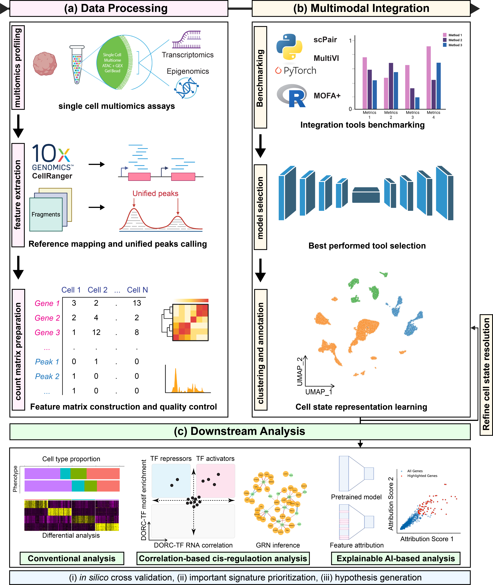

# scMINA

scMINA is a Nextflow-based framework for single-cell multimodal (RNA + ATAC) analysis. It combines scPair deep generative modeling as an option in Python with Seurat and FigR workflows in R for gene regulatory network (GRN) inference, and explainable downstream analysis.


## Installation

1. **Clone the repository:**
   ```bash
   git clone git@github.com:ShuwenZhangswz/scMINA.git
   cd scMINA
   ```

2. **Set up the conda environment:**
   ```bash
   ./setup.sh
   ```

3. **Activate the environment:**
   ```bash
   conda activate scmina
   ```


## Dependencies

All dependencies are managed through conda and specified in `environment.yml`.

### Python Dependencies
- Python>=3.10,<3.13
- scpair>=0.1.0
- scvi-tools>=1.0.0
- numpy, pandas, scipy, scikit-learn
- matplotlib, seaborn, scanpy, anndata
- See `environment.yml` for the full and up-to-date list.

### R / Bioconductor Dependencies
- R>=4.2.2
- Seurat and SeuratObject
- FigR and supporting Bioconductor packages for ATAC and GRN analysis
- See `environment.yml` for the full list of R/Bioconductor packages.

### Environment files

- `environment.yml` – main conda environment with Python + R
- `nextflow.config` – Nextflow configuration and resource labels


## Nextflow integration and overall workflow

scMINA is designed to work seamlessly with Nextflow, orchestrating both Python (scPair) and R (Seurat + FigR) processes in the same environment.

### Quick start with Nextflow

1. **Set up the conda environment:**
   ```bash
   ./setup.sh
   ```

2. **Run the example workflow:**
   ```bash
   nextflow run workflows/example_workflow.nf -profile local_activated
   ```


### Multimodal integration and downstream analysis workflows using scPair and FigR



The figure above and the schematic below summarize how the main workflows connect across data processing, multimodal integration, and downstream GRN analysis:

```text
scpair_train.nf  -->  scpair_cluster.nf
      |                    |
      v                    v
  scPair embeddings   cluster labels
          |
          v
integrate_scpair_multiome.nf
          |
          v
  Seurat object with scPair embeddings
          |
          v
      figr_pipeline.nf
          |
          v
   FigR GRN results and plots
```


## Workflows

### scPair training, clustering, and feature attribution (Python)

The scPair workflows handle multimodal integration in Python and provide clustering and feature attribution on learned embeddings.

```bash
# Full scPair pipeline: train -> embeddings -> clustering
nextflow run workflows/scpair_pipeline.nf --input_h5ad /path/to/paired.h5ad

# Or with separate inputs (rna + atac + meta + splits):
nextflow run workflows/scpair_pipeline.nf --input_mode separate \
  --input_rna /path/to/rna.h5ad --input_atac /path/to/atac.h5ad \
  --input_meta /path/to/meta.csv --input_index_dir /path/to/splits/

# Clustering only (using existing embeddings from a prior run):
nextflow run workflows/scpair_pipeline.nf --run clustering_only --embeddings_dir /path/to/embeddings/

# Feature attribution (after choosing resolution):
nextflow run workflows/feature_attribution.nf \
  --adata /path/to/adata.h5ad \
  --checkpoint_dir /path/to/checkpoints/ \
  --cluster_labels /path/to/cluster_labels_res0.9.csv \
  --attribution_method both --baseline both --output_ranked --top_n_genes 50
```

See `../scpair_nextflow_pipeline_plan.md` for more details on the scPair pipeline.


### Integration of scPair embeddings into Seurat (R)

The `workflows/integrate_scpair_multiome.nf` workflow runs the R helper `scripts/integrate_scPair_multiome.R` to:

- Load a multiome Seurat object and scPair embeddings exported from the Python pipeline.
- Add scPair embeddings as a Seurat `DimReduc`.
- Perform graph construction, clustering, and UMAP.
- Save updated Seurat objects, markers, and plots.

Example:

```bash
nextflow run workflows/integrate_scpair_multiome.nf \
  --seurat_obj_path /path/to/multiome_seurat.rds \
  --scpair_csv /path/to/scpair_embeddings.csv \
  --metadata_csv /path/to/metadata.csv \
  --resolution 0.9 \
  --prefix Sample1
```


### FigR preprocessing and GRN analysis (R)

The `workflows/figr_pipeline.nf` workflow connects the Seurat object with scPair embeddings to FigR. It runs two R helpers in sequence:

1. `scripts/prep_FigR_inputs.R` – builds FigR-ready inputs from multiome matrices and the Seurat object:
   - ATAC `SummarizedExperiment` (`ATAC.se`)
   - normalized RNA matrix (`RNAmat`)
   - cell kNN index (`cellkNN`) derived from scPair embeddings
2. `scripts/run_FigR_analysis.R` – performs:
   - peak–gene correlation testing
   - DORC identification and visualization
   - DORC and RNA smoothing
   - GRN inference and TF driver ranking

Example:

```bash
nextflow run workflows/figr_pipeline.nf \
  --atac_mtx /path/to/ATACmat.mtx \
  --rna_mtx /path/to/RNAmat.mtx \
  --metadata_csv /path/to/metadata.csv \
  --genes_csv /path/to/genes.csv \
  --peaks_csv /path/to/peaks.csv \
  --seurat_scpair_rds /path/to/Sample1_scPair_final_res0.9.rds \
  --prefix Sample1 \
  --genome hg38
```


## System requirements

- **GPU:** `scpair_train`, `scpair_inference`, and `feature_attribution` require at least 1 GPU (PyTorch/CUDA). `scpair_cluster` is CPU-only. For SLURM, `nextflow.config` requests `--gres=gpu:1` for GPU processes.
- **Local runs:** Use `-profile local_activated`; ensure CUDA is available if running scPair steps locally.
- The same conda environment is used for all Python (scPair) and R (Seurat + FigR) steps; see `environment.yml` and `nextflow.config` for resource labels and profiles.

### Workflow features

- **Unified environment**: Both Python and R in the same conda environment.
- **Cluster support**: Configured for SLURM, PBS, SGE, and local execution.
- **Resource management**: Automatic CPU/memory allocation (GPU for scPair train/inference/attribution).
- **Error handling**: Retry logic and error reporting.
- **Resume capability**: Continue failed workflows from where they stopped.


## Development

### Adding new dependencies

```bash
# Add to environment.yml, then update
conda env update -f environment.yml
```

```bash
conda activate scmina
```

Notes:
- The conda env pins R to 4.2.2 to match the testing cluster.
- If a conda solve fails due to strict R package pins, prefer installing that package via BiocManager after env creation.

When adding new R/Bioconductor dependencies for analysis steps, prefer updating `environment.yml` first. For packages not available on conda, install them inside the environment using BiocManager or remotes.

### Installing Bioconductor/CRAN R packages inside the env

Some Bioconductor packages are not reliably available as conda recipes at specific versions. After activating the env, install them in R directly as needed.

### Verify versions

```bash
R --version
python --version
```


## Authors

- Shuwen Zhang (zhang.shuwen@mayo.edu)
- Hongru Hu (hrhu@ucdavis.edu)
